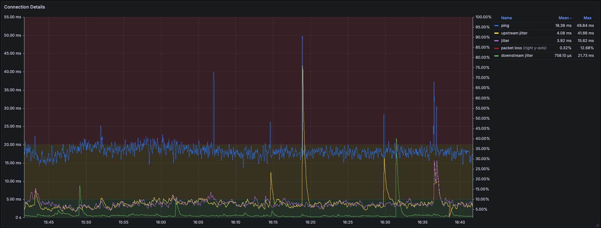

# jittermon
[](https://codecov.io/gh/wafer-bw/jittermon)
[](https://github.com/wafer-bw/jittermon/actions/workflows/checks.yml)



```sh
# build docker image
docker build -t jittermon .
# start the demo
docker compose -f demo/docker-compose-local.yml up -d
# http://localhost:3000/d/aec2tnhcwbuo0b
docker compose -f demo/docker-compose-local.yml down
```

```sh
# deploy to fly
fly deploy
# start the demo
docker compose -f demo/docker-compose-fly.yml up -d
# http://localhost:3000/d/aec2tnhcwbuo0b
docker compose -f demo/docker-compose-fly.yml down
```

## Notes
- Won't work in fly.io with a shared IPv4, you will need a dedicated one which
  costs $2/mo.

## TODOs

### Refactor
  - p2platency implementation using http
    - decide how to organize this split
  - simplify recorder interface by using interface assertion to
    - determine sample type
    - determine labels
    - determine timestamp
    - (no longer need `Sample` or `SampleType`)
  - move logger into context

### Misc
- add contextual log handler for common attributes
- add a way to request samplers by name
- consider contractually ensuring samplers emit samples, and conform to a common
  `Sampler` interface.
- handle src/dst id/address confusion
- back off send rate when failing
- should `jitter.minSamples` be 3?
- route tracing
  - hop filtering in grafana
  - more useful visualizations
- persist loki data locally
- promote samplers out of internal
- long term nice to have
  - add code tracing via otel
    - collect traces in grafana via mimir
  - make checks workflow only runs when go code changes
  - Use ICMP for RTT?
  - Look into establishing streaming connections to avoid TCP overhead?
  - Cobra CLI
